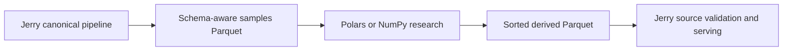

# Research Workflow

Jerry can export assembled samples as a schema-aware Parquet table for research
in Polars, NumPy, or another analytical tool. A derived table can then return as
an ordinary Jerry source. This keeps experimentation outside the streaming
runtime while preserving Jerry's validation and reproducible dataset build.



## 1. Export assembled samples

Install the optional Parquet support and the research tool separately:

```bash
python -m pip install "jerry-thomas[parquet]" polars
```

Export the `samples` preview from one serve profile:

```bash
jerry serve \
  --project path/to/project.yaml \
  --profile dataset \
  --preview samples \
  --output-transport fs \
  --output-format parquet \
  --output-directory research/export
```

Jerry prints the concrete run-scoped output path. The table uses explicit
namespaces such as `sample.time`, `sample.ticker`, `features.adv_20`, and
`targets.forward_return`.

`samples` is the useful research boundary: series have been assembled into
rows, but postprocess filtering, split routing, and fold-specific scaling have
not run. Use `--preview postprocess` when the research input should include the
configured postprocess policy.

### Consume completed runs from Python

`run_profiles()` returns a tuple of `SavedRun` objects after execution and
publication succeed, for both serve and materialize:

```python
from jerrythomas.profiles.orchestration import run_profiles
from jerrythomas.profiles.request_builder import build_runtime_run_request

request = build_runtime_run_request(
    "serve", "path/to/project.yaml", profile_name="dataset",
)
results = () if request is None else run_profiles(request)
for result in results:
    print(result.metadata.run_id, result.metadata_path)
    for output_path in result.outputs:
        print(output_path)
```

`SavedRun` in `jerrythomas.io.runs` exposes `metadata_path`, `directory`, the
shared `metadata` model, and absolute `outputs` paths. `output()` selects an
output descriptor; `output_path()` validates and resolves its file.

Serve profiles sharing a run directory contribute to one result. Materialize
returns one result per profile in execution order, with a shared invocation ID.
It automatically saves `<output filename>.run.json` beside each output. Receipts
record command, timestamps, status, profile, stream or operation, file format,
compression, and row count. Preview and split metadata apply to serve.

Build, inspect, and stdout-only execution return an empty tuple. Execution or
publication failures raise instead of returning partial results. Materialize
profiles commit independently: earlier completed files and receipts remain valid
if a later profile fails.

For subprocess callers, both commands accept `--result-json`; see
[completed run results](cli.md#completed-run-results). Receipt persistence is
automatic whether or not this flag is used.

### Read a saved run

`load_run()` reads a completed run without loading `project.yaml`, resolving
artifacts, or executing a pipeline:

```python
from jerrythomas.io.runs import load_run

saved = load_run("research/output/latest")  # or a concrete run directory
train = saved.output("dataset", "fold_0.train")
train_path = saved.output_path("dataset", "fold_0.train")
print(train.format, train.row_count, train.fold.labels)
```

Selection uses the original profile name and exact output ID, independently of
filename sanitization. For an unsplit output, use `saved.output_path("dataset")`.
Omitting the ID never guesses a fold or selects all roles. Missing selections
raise `KeyError`.

`saved.metadata.outputs` contains all output descriptors in execution order.
Each records the profile, operation, output ID, relative POSIX path, format,
view, encoding, compression, actual row count, and optional fold identity
(`id`, `role`, and configured split labels). Row counts include only records
written after limits and filtering: empty files have zero rows, a payload has
one record, and HTML has `null` because it is a rendered document. Preview
outputs have no fold identity; `saved.metadata.preview` records their stage.

`saved.metadata.split` contains the resolved `SplitConfig` captured before
execution: time intervals and folds, or hash ratios, seed, and folds. It is
`None` for an unsplit project. Fold output IDs, roles, and labels must agree
with these saved rules; inconsistent manifests are rejected. A preview retains
the project's split configuration, but its outputs do not claim fold membership.

For a time split, use the saved rules to label a JSONL sample without reopening
project configuration:

```python
from jerrythomas.config.dataset.split import TimeSplitConfig
from jerrythomas.pipelines.dataset.split import build_labeler

assert isinstance(saved.metadata.split, TimeSplitConfig)
labeler = build_labeler(saved.metadata.split)
label = labeler.label(sample["key"])
```

Hash labeling requires the original typed sample key: its hash input is the
key's Python representation. JSON converts tuples to lists and timestamps to
strings, so passing a JSON-decoded key directly can assign a different label.
The saved hash configuration preserves the rules; it does not reconstruct key
types from output files.

Changing a project's boundaries or hash seed does not alter an existing run's
saved rules. These rules describe label assignment and fold membership; they
do not capture the full dataset configuration, including target horizons and
postprocess policies.

Both receipt layouts use `schema_version: 2`, independently of the package
and project schema versions. They retain run ID, timestamps, status, notes, and
preview, and list completed files under `outputs`. Output descriptors are
written atomically with successful completion; serve then publishes `latest`.
Failed runs are not readable through `load_run()`.

Loading reads only the manifest. `output_path()` checks that the selected file
exists within the run directory; it does not open data or check unselected files.
This permits selecting training data without opening holdout data. A loaded
`latest` is pinned to that concrete run even if another run later replaces the
symlink. Relative paths let you copy a run directory and read it after the
original project has changed or been removed.

The `split` field is required even when its value is `null`. Unversioned
manifests, manifests missing `split`, and unknown schema versions are rejected.
Produce a new run with v11 to use this reader; there is no legacy filename
discovery fallback.

For a materialized file, pass its receipt directly:

```python
saved = load_run("interim/volatility.jsonl.gz.run.json")
path = saved.output_path("volatility")
```

Materialize destinations are mutable. `output_path()` rejects a loaded receipt
if Jerry has since replaced it; reload it to select the current output. Data and
receipt files can be copied together and loaded independently of the project.


## 2. Derive a series with Polars

This example ranks `adv_20` across tickers at each timestamp and writes one
canonical record series:

```python
from pathlib import Path
import sys

import polars as pl


samples_path = Path(sys.argv[1])
output_path = Path("research/adv_rank.parquet")
output_path.parent.mkdir(parents=True, exist_ok=True)

(
    pl.scan_parquet(samples_path)
    .select(
        pl.col("sample.time").alias("time"),
        pl.col("sample.ticker").alias("ticker"),
        pl.col("features.adv_20")
        .rank(method="average")
        .over("sample.time")
        .alias("value"),
    )
    .sort(["ticker", "time"])
    .sink_parquet(output_path)
)
```

Run it with the Parquet path printed by `jerry serve`:

```bash
python research/derive_adv_rank.py /absolute/path/to/dataset.parquet
```

Prefer native Polars expressions over Python row callbacks. Use NumPy,
scikit-learn, or statsmodels alongside Polars for algorithms that are naturally
matrix-based, such as PCA or regression.

## 3. Reingest the derived table

Declare the local Parquet file as a normal source:

```yaml
# sources/research.adv-rank.yaml
id: research.adv-rank
parser:
  entrypoint: core.temporal_record
loader:
  transport: fs
  path: research/adv_rank.parquet
  reader:
    format: parquet
```

Expose its canonical records as a stream:

```yaml
# streams/research.adv-rank.yaml
id: research.adv-rank
from:
  source: research.adv-rank
map:
  entrypoint: identity
partition_by: [ticker]
presorted: true
```

Then reference the field from `dataset.yaml`:

```yaml
features:
  - id: adv_rank
    stream: research.adv-rank
    field: value
```

The Polars script sorts by the stream's canonical order, so `presorted: true` lets
Jerry validate that order in one pass and skip external sorting. If the producer
cannot guarantee canonical order, omit `presorted` or set it to `false`; Jerry will sort the stream.
Never declare `presorted: true` based only on an assumption.

The research producer remains responsible for feature semantics and leakage.
Jerry still validates timestamps, stream ordering, sample identity, metadata,
and downstream dataset contracts when the derived series is reingested.
